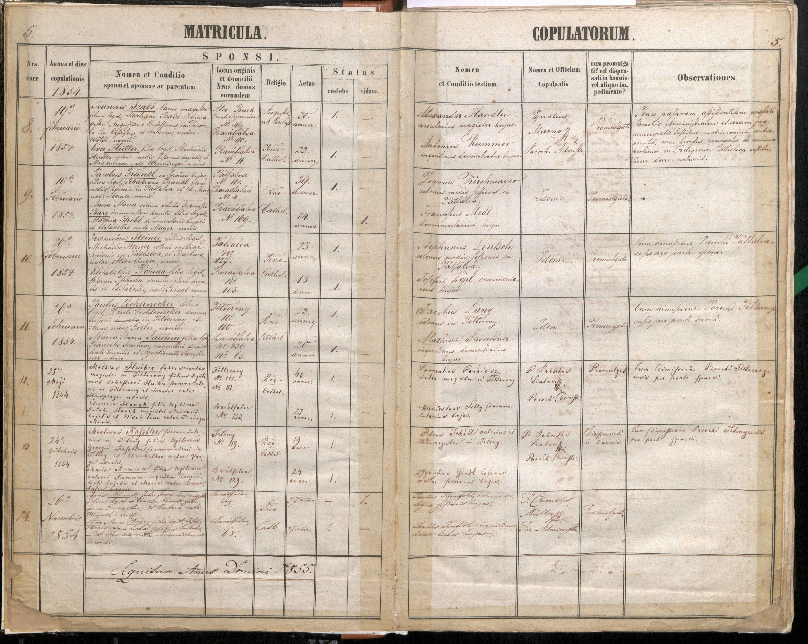

# Optical character recognition on historical handwritten texts

Repository for the Austrian Register Data Project 📖

---

**Given**: Dataset of historical handwritten text from Austrian birth, baptism, marriage, and death registers. Archives are present in tabular form (table being hand-drawn or block-printed) and text is cursive handwriting. [Metricula online dataset](https://data.matricula-online.eu/en/bestande/).

**Overview**

- Text dates 1625-2006. More info [here](https://data.matricula-online.eu/en/allgemeine-infos/).
- 183,312 church registers; 4,502,868 images scraped and stored on AWS S3.

Sample ground truth:


> **Notes on dataset:**

- Tables are not uniform in structure (variation in fields/columns), owing to the range of periods and geographic locations the dataset comes from
- Handwriting styles vary due to differences in human-writers and periods
- Noise is present in the form of ink blots, parchment texture, or general wear and tear of the physical documents

> Matricula images were scraped using [austrian_register_project/Scraper at main · sodalabsio/austrian_register_project (github.com)](https://github.com/sodalabsio/austrian_register_project/tree/main/Scraper); originally <https://github.com/1fge/matricula-online-scraper>

> Sample Matricula dataset present at: https://drive.google.com/drive/folders/15eqsj8LIIz9bv_VLS8pzlua7WvbymnSn?usp=sharing

**\*Full dataset**: on AWS S3 bucket “austrian-register-data”. Ask access from Satya Borgohain. (Some part of it) transferred to Paul’s M3; 496 images at /projects/oc23/mini_images/ and transcriptions at /projects/oc23/austrian_images.txt.\*

---

## Setting Up Access

To access the Handwriting OCR and TRANSKRIBUS services, set the following environment variables in a `.env` file:

```plaintext
HANDWRITING_OCR_USERNAME=<your-username>
HANDWRITING_OCR_PASSWORD=<your-password>
TRANSKRIBUS_USERNAME=<your-username>
TRANSKRIBUS_PASSWORD=<your-password>
```

---

## Aim
To perform layout analysis and handwritten text recognition (HTR) on the images, extract tabular data from the parish records, and identify key figures from the regions, tracking their descendants' economic progress over the decades that followed, including key periods such as World War I and many more.

---

### Sub-aim 1 
To ***Using LLM toools transcribe some real Austrian birth certificates*** from the archives to obtain rich ground truth (limited in size due to human annotation), hence reducing the CER rate further.

Path of images: [./assets/images/mini_images/](./assets/images/mini_images/)  
Path of corresponding transcriptions: [./assets/docs/austrian_images.txt](./assets/docs/austrian_images.txt)  
No. of word-level images transcribed: 496

**Work done by past researchers like Yash & Ali are as follows**,
For this, we used [Transkribus](https://readcoop.eu/transkribus/) desktop app. Scripts in place:
- In Yashdeep’s local (written by Ali): transkribus_API.py, word polygon extraction.ipynb. These are for generating a CSV containing the prediction for the word, ground-truth, and character error rate (CER). 
- **Model**: PyLaia HTR 27457. We used this model hosted on transkribus servers to get some rudimentary transcriptions; later we refined these transcriptions by hand (done by Paul for ~500 word-images).
    - Net Name: **German_Kurrent_17th-18th (10th Nov, 2020)**
    - Language: **german**, latin, french
    - No. of words trained on: 1839841
    - CER Train: 6.00%; CER Val: 5.50%

---

### Sub-aim 2
To ***train an HTR model*** using both the above labelled opensource dataset (HANA) and the hand-transcribed data by Paul with the help of Transkribus above.

Current model being explored: [TrOCR](https://paperswithcode.com/method/trocr)  
Path in M3: `/oc23/trocr/`

---

### Sub-aim 3
To ***infer (test) the above HTR model*** on our Austrian birth dataset (transcribed using Transkribus by Paul and Sascha)

---

### **Sub-aim 4**

To **extract and classify key entities**—specifically names, professions, and place names—from the HTR model outputs. This involves applying **named entity recognition (NER)** and **text classification techniques** on each structured row of the digitized records. The objective is to systematically segment out individual names, recorded professions (occupations), and geographical locations (villages, towns, parishes, etc.) present in the historical documents. The extracted entities will be further categorized and aggregated to provide insights into:

- The **distribution and frequency** of given names and surnames
- **Common and rare professions** across different periods and regions
- **Geographic clustering** of families and occupations

This sub-aim supports downstream analysis such as **demographic mapping, social mobility studies,** and **regional economic profiling**, enabling a richer understanding of population structure and occupational trends in historical Austrian society.

---

### **Sub-aim 5**

To **construct historical social networks** by mapping relationships and associations extracted from each record in the birth, marriage, and death registers. Using the classified entities from Sub-aim 5, this stage involves identifying and linking individuals based on documented **family ties** (parents, children, spouses), **godparent relationships** (as found in baptismal records), and other recorded associations. The goal is to create a comprehensive **connection graph** for each individual, revealing patterns of social connectivity, kinship, and community structure over time.

This networked approach will enable:

- **Tracing lineage and familial relationships** across generations
- **Analyzing the roles of godparents, witnesses,** and other community members in social cohesion
- **Studying the evolution** of interconnected families, migration patterns, and the spread of professions within regions

Ultimately, Sub-aim 6 aims to provide a **dynamic, searchable model of historical social networks**, offering researchers new ways to explore the interconnectedness of individuals and families in Austrian society from **1625 to 2006**.

---

### **Sub-aim 6**

To **conduct demographic and longitudinal analyses** leveraging the classified names, professions, and locations, as well as the social networks constructed in previous sub-aims. This phase focuses on examining how individuals and families were **clustered by profession, geographic origin, and social connectivity**. By linking historical register data to broader historical contexts—such as key events or periods of social change (e.g., radical movements)—the analysis can trace lineages back to specific towns or regions, revealing **ancestral connections and patterns of association**.

The aim is to:

- **Identify demographic clusters** and the spatial distribution of professions and families
- **Trace economic and occupational trajectories** of individuals and families across generations
- **Analyze how factors** such as geographic origin, profession, and social ties influenced upward mobility and livelihood improvements over time

Through this sub-aim, the project aspires to **uncover stories of economic progress, shifts in social status,** and the **impact of historical events on community development**, providing valuable insights for historians, genealogists, and social scientists.

 
